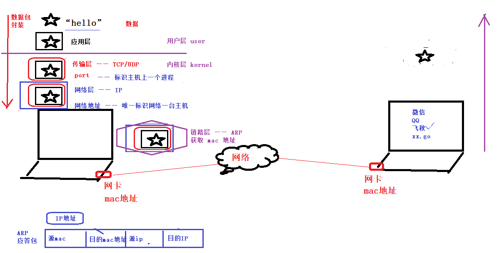

# 协议： 一组规则。要求使用协议的双方，必须严格遵守协议内容。

## 网络分层架构

>  OSI七层模型结构体： 物理层、数据链路层、网络层、传输层、会话层、表示层、应用层
>  TCP/IP 四层模型：数据链路层、网络层、传输层、应用层

## 各层功能

### 链路层 ARP协议 （它会帮助我们寻找另一台设备上的mac地址）

> 源mac地址 —— 目标mac地址
>
> ARP 协议作用： 借助 IP 获取 mac 地址。
>
> arp -a 可以查看arp列表

### 网络层   IP 协议（它会帮助我们在网络当中确定一台主机）

> 源IP —— 目标IP
> IP协议的作用： 在 网络环境中唯一标识一台主机。
>
> IP地址本质：2进制数。—— 点分十进制 IP地址 （string）

### 传输层  TCP / UDP 协议 

> port —— 在 一台主机上唯一标识一个进程。

### 应用层 ftp、http、自定义协议

>对数据进行封装。 解封装。

### 数据通信过程

​	封装： 应用层 —— 传输层 —— 网络层 —— 链路层	。 没有经过封装的数据，不能在网络环境中传递。

​	解封装 ： 链路层 —— 网络层 —— 传输层 —— 应用层

## 总结通信过程

1. mac地址（不需要用户指定）		(ARP 协议)ip ——> mac

2. IP 地址 （需要用户指定）	—— 确定主机

3. port 端口号 （需要用户指定）	—— 确定程序

	1. 不能使用系统占用的默认端口。	尽量使用5000+以上的端口号 （特殊的除外8080）	
2. 65535为端口上限。 

# 通信方式

## 对于点对点之间的[通信](https://baike.baidu.com/item/通信/300982)，按照消息传送的方向与时间关系，通信方式可分为[单工通信](https://baike.baidu.com/item/单工通信/4535229)、[半双工通信](https://baike.baidu.com/item/半双工通信/10924584)及[全双工通信](https://baike.baidu.com/item/全双工通信/8752822)三种。

### 单工通信

​	所谓单工通信，是指消息只能单方向传输的工作方式。例如遥控、遥测，就是单工通信方式

### 半双工通信

​	所谓半双工通信，即通信的双方都可以发送信息，但不能双方同时发送（当然也就不能同时接收）。这种通信方式是一方发送另一方接收，过一段时间后再反过来。例如 对讲机 摁下传输消息，松开接收对方消息

### 全双工通信

​	所谓半双工通信，即通信的双方可以同时发送和接收信息的信息交互方式。例如电话

## socket 套接字通信方式 是全双工通信

> 网络通信过程中，socket 一定是成对出现的。

## 网络应用设计模式：

**C/S: client(客户端)/server(服务端)**
	**优点：数据传输效率高、协议选择灵活**

​	**缺点：工作量大、安全性构成威胁**
**B/S: broswer(浏览器)/server(客户端)**
​	**优点：开发工作较小、不受平台限制、安全威胁小**

​	**缺点：缓存数据差、协议选择不灵活**

