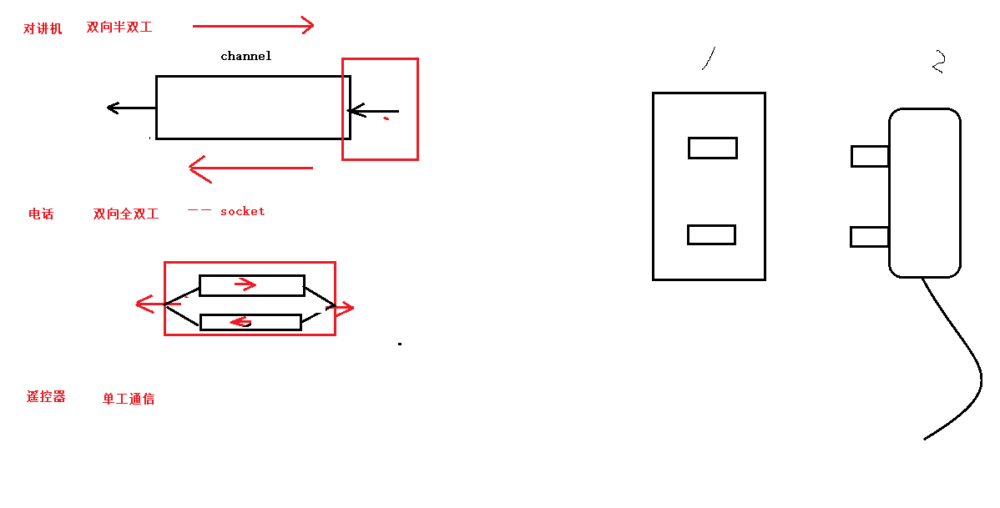
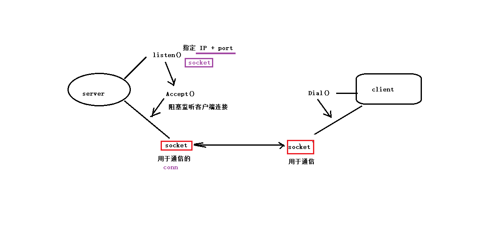
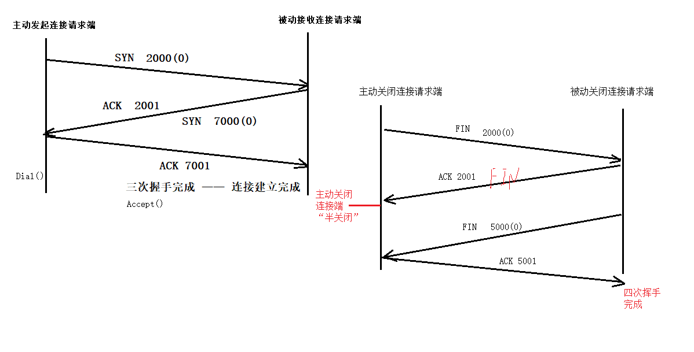
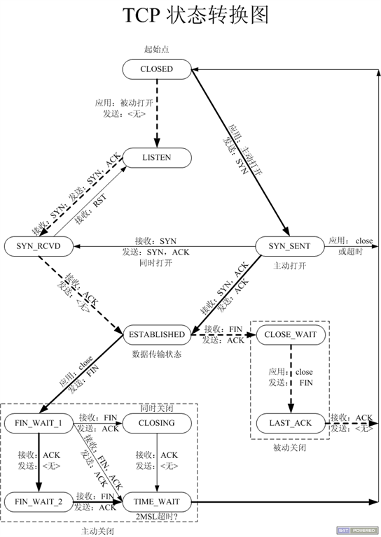

#  协议： 一组规则。要求使用协议的双方，必须严格遵守协议内容。

## 网络分层架构

>  OSI七层模型结构体： 物理层、数据链路层、网络层、传输层、会话层、表示层、应用层
>  TCP/IP 四层模型：数据链路层、网络层、传输层、应用层

## 各层功能

### 链路层 ARP协议 （它会帮助我们寻找另一台设备上的mac地址）

> 源mac地址 —— 目标mac地址
>
> ARP 协议作用： 借助 IP 获取 mac 地址。
>
> arp -a 可以查看arp列表

### 网络层   IP 协议（它会帮助我们在网络当中确定一台主机）

> 源IP —— 目标IP
> IP协议的作用： 在 网络环境中唯一标识一台主机。
>
> IP地址本质：2进制数。—— 点分十进制 IP地址 （string）

### 传输层  TCP / UDP 协议 

> port —— 在 一台主机上唯一标识一个进程。

### 应用层 ftp、http、自定义协议

>对数据进行封装。 解封装。


### 数据通信过程

​	封装： 应用层 —— 传输层 —— 网络层 —— 链路层	。 没有经过封装的数据，不能在网络环境中传递。

​	解封装 ： 链路层 —— 网络层 —— 传输层 —— 应用层

## 总结通信过程

1. mac地址（不需要用户指定）		(ARP 协议)ip ——> mac

2. IP 地址 （需要用户指定）	—— 确定主机

3. port 端口号 （需要用户指定）	—— 确定程序

	1. 不能使用系统占用的默认端口。	尽量使用5000+以上的端口号 （特殊的除外8080）	
2. 65535为端口上限。 

# 通信方式



## 对于点对点之间的[通信](https://baike.baidu.com/item/通信/300982)，按照消息传送的方向与时间关系，通信方式可分为[单工通信](https://baike.baidu.com/item/单工通信/4535229)、[半双工通信](https://baike.baidu.com/item/半双工通信/10924584)及[全双工通信](https://baike.baidu.com/item/全双工通信/8752822)三种。

### 单工通信

​	所谓单工通信，是指消息只能单方向传输的工作方式。例如遥控、遥测，就是单工通信方式

### 半双工通信

​	所谓半双工通信，即通信的双方都可以发送信息，但不能双方同时发送（当然也就不能同时接收）。这种通信方式是一方发送另一方接收，过一段时间后再反过来。例如 对讲机 摁下传输消息，松开接收对方消息

### 全双工通信

​	所谓半双工通信，即通信的双方可以同时发送和接收信息的信息交互方式。例如电话


## socket 套接字通信方式 是全双工通信

> 网络通信过程中，socket 一定是成对出现的。

## 网络应用设计模式

```
C/S: client(客户端)/server(服务端)
	优点：数据传输效率高、协议选择灵活
	缺点：工作量大、安全性构成威胁
B/S: broswer(浏览器)/server(客户端)
	优点：开发工作较小、不受平台限制、安全威胁
	缺点：缓存数据差、协议选择不灵活
```




### TCP-CS服务器

```go
1.  创建监听socket  listener := net.Listen("TCP", "IP+port")	IP+port	—— 服务器自己的IP 和 port

2.  启动监听  conn := listener.Accept()  conn 用于 通信的 socket

3.  conn.Read()  

4.  处理使用 数据

5.  conn.Write()

6.  关闭  listener、conn
```

### TCP-CS客户端

```go
1.  conn, err := net.Dial("TCP", 服务器的IP+port)

2.  写数据给 服务器 conn.Write()

3.  读取服务器回发的 数据 conn.Read()

4.  conn.Close()
```

### TCP-CS并发服务器

```go
1.  创建 监听套接字 listener := net.Listen("tcp"， 服务器的IP+port)		// tcp 不能大写

2.  defer listener.Close()

3.  for 循环 阻塞监听 客户端连接事件 	conn := listener.Accept()

4. 创建 go程 对应每一个 客户端进行数据通信	go HandlerConnet()

5. 实现 HandlerConnet(conn net.Conn) 

	1) defer conn.Close()

	2) 获取成功连接的客户端 Addr 		conn.RemoteAddr()

	3) for 循环 读取 客户端发送数据		conn.Read(buf)

	4) 处理数据 小 —— 大	strings.ToUpper()

	5）回写转化后的数据		conn.Write(buf[:n]) 


package main
// tcp socket 链接 net 玩玩
import (
	"fmt"
	"net"
	"strings"
)
func handConn(conn net.Conn) {
	defer conn.Close()

	addr := conn.RemoteAddr()
	fmt.Println("客户端成功链接地址为",addr)
	buf := make([]byte,4096)
	for {
		n , err := conn.Read(buf)
		if n == 0 {
			fmt.Println("服务器检测到客户端断开连接！！",addr)
			return
		}
		if err != nil {
			fmt.Println("conn.Read错误",err)
			return
		}
		fmt.Println("服务器读取到数据：",string(buf[:n]),,addr)
		word := strings.ToUpper(string(buf[:n]))
		conn.Write([]byte(word))
	}
}		


func main() {
	listener,_ := net.Listen("tcp","127.0.0.1:8000") // 创建一个socket套接字
	fmt.Println("等待建立链接。。")
	defer listener.Close()

	for {
		conn,err := listener.Accept()
		if err != nil {
			fmt.Println("建立链接时错误",err)
			return
		}
		go handConn(conn)
	}
}
```

### 服务器判断关闭：Read读客户端/服务器，返回 零  ——  对端关闭！

### TCP-CS并发客户端

```go
1. 匿名 go 程 ， 获取 键盘输入， 写给服务器

2. for 循环读取服务器回发数据

package main
// tcp socket 链接 net 玩玩
import (
	"fmt"
	"net"
	"os"
)

func main() {
    // 建立连接
	conn,err := net.Dial("tcp","127.0.0.1:8000")
	defer conn.Close()
	if err != nil {
		fmt.Println("net.Dail错误",err)
		return
	}
	go func() {
		str := make([]byte,4096)
		for {
			n,err := os.Stdin.Read(str)
			if err != nil {
				fmt.Println("os.Stdin.Read",err)
				continue
			}
			conn.Write(str[:n])
		}
	}()

	buf := make([]byte,4096)
	for {
		n,err := conn.Read(buf)
		if err != nil {
			fmt.Println("Read",err)
			continue
		}
		fmt.Println("读取到服务器返回的数据：",string(buf[:n]))
	}
	
}
```

### TCP通信过程





```go
三次握手：

	1. 主动发起请求端， 发送 SYN 

	2. 被动建立连接请求端 ， 应答ACK 同时 发送 SYN

	3. 主动发起请求端，发送应答  

	标志 TCP 三次握手建立完成。 —— server：Accept() 返回 。 	—— client：Dial() 返回。

四次挥手：

	1. 主动关闭连接请求端， 发送 FIN

	2. 被动关闭连接请求端 ，应答 ACK
					标志。半关闭完成。 —— close()
	3. 被动关闭连接请求端 ，发送 FIN

	4.  主动关闭连接请求端，应答 ACK
					标志。四次挥手建立完成。 —— close().
```
